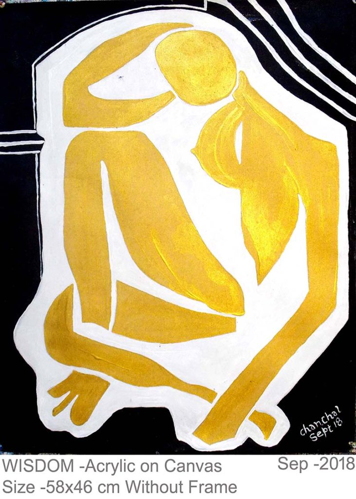

# Canvas by Heart Website

Welcome to the project repository for **Canvas by Heart**! This guide will help you update the website content, add new paintings to the gallery, or even add video clips.

If you are using **github.dev** (Github Web Editor), you can do all of this directly in your browser.

## 🖼️ Managing Gallery Images

The gallery is a carousel of images located in the `index.html` file.

### How to Add a New Painting
1.  **Upload the Image**:
    *   On the left sidebar, navigate to `images` -> `arts`.
    *   Right-click on the `arts` folder and select **Upload**.
    *   Select your new image file (e.g., `my-new-painting.jpg`).
2.  **Add it to the Website**:
    *   Open `index.html`.
    *   Search for **"Gallery"** or scroll to around line 105.
    *   You will see a list of lines starting with `
    
    
    <!-- YOUR NEW IMAGE -->
    
    ```

### How to Remove a Painting
1.  Open `index.html`.
2.  Find the line with the image you want to remove.
3.  Simply delete that entire line.

---

## 🎥 Adding a Video

You can add videos to the website (e.g., a painting process video or an exhibition clip).

### Step 1: Upload the Video
1.  On the left sidebar, verify if you have a `videos` folder. If not, right-click the empty space in the sidebar, choose **New Folder**, and name it `videos`.
2.  Right-click the `videos` folder and upload your video file (MP4 format is best).

### Step 2: Add the Video Player
Decide where you want the video to appear in `index.html`. You can paste the following code block anywhere in the content sections (like inside `<div class="about-content">` or in a new section).

**Copy and paste this code:**

```html
<div class="video-container" style="margin: 2rem 0; text-align: center;">
  <video controls style="max-width: 100%; border-radius: 8px; box-shadow: 0 4px 15px rgba(0,0,0,0.2);">
    <!-- Replace 'your-video-name.mp4' with your actual file name -->
    <source src="videos/your-video-name.mp4" type="video/mp4">
    Your browser does not support the video tag.
  </video>
  <p style="font-style: italic; margin-top: 0.5rem; color: #666;">Description of the video</p>
</div>
```

**Note**: Replace `your-video-name.mp4` with the actual name of the file you uploaded.

---

## 📝 Editing Text
This website uses a dual-system for text:
1.  **Long Text (like the "About" section)**: Edited directly in `index.html`.
2.  **Short Text (Headlines, Buttons)**: Edited in `localization.js` (because it changes when you switch languages).

### 1. Editing the "About" Section (Bio)
*   Open `index.html`.
*   Search for `<section id="about"`.
*   You will see paragraphs like `<p>My paintings are...</p>`.
*   Edit the text inside the `<p>` and `</p>` tags.

### 2. Editing Headlines & Buttons (Language Support)
If you try to edit a headline in HTML and it "changes back" when you reload, it's because it's controlled by the language script.
*   Open `localization.js`.
*   You will see a list of translations for English (`en`) and Indonesian (`id`).
*   **Example:**
    ```javascript
    en: {
      tagline: "Original impressionistic masterpieces...",
      // ...
    }
    ```
*   Update the text inside the quotes for the language you want to change.

---

## 💻 For Developers

This works as a static website.
*   **Tech Stack**: HTML5, CSS3, Vanilla JavaScript.
*   **Running Locally**: Simply open `index.html` in any web browser, or use a "Live Server" extension in VS Code.
